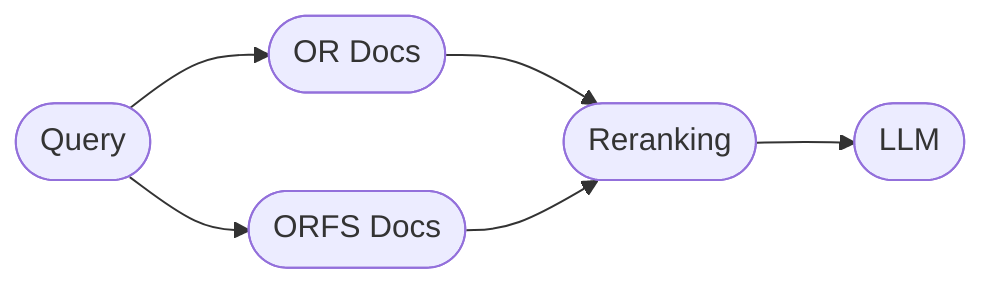

# OR-Assistant

## Setup

### Option 1 - Docker

Ensure you have `docker` and `docker-compose` installed in your system.

- **Step 1**: Clone the repository:
```bash
  git clone https://github.com/The-OpenROAD-Project/ORAssistant.git
``` 
- **Step 2**: Copy the `.env.example` file, and update your `.env` file with the appropriate API keys. Get the [Google Gemini API Key](https://ai.google.dev) and add it to your env file, add other env vars as required.
```bash
  cd backend
  cp .env.example .env
```

- **Step 3**: Start the server by running the following command,
```bash
  docker compose up
```

### Option 2 - Local Install

- Follow **Step 1** and **Step 2** as mentioned above.
- **Step 3**: To scrape OR/ORFS docs and populate the `data` folder, run
```bash
  cd backend
  python scrape_userguide.py
```
- **Step 4**: To run the server,
```bash
  python main.py
```

## Architecture Overview

Currently, documentation from OpenROAD and OpenROAD-flow-scripts is chunked recursively and embedded into FAISS Vector Databases.  

Upon receiving a query, relevant documents are retrieved and reranked, using [LangChain's Ensemble Retriever](https://python.langchain.com/v0.1/docs/modules/data_connection/retrievers/ensemble/).

Retrieved documents are then sent to the LLM as input context, for generating a response.



By default,

The backend will then be hosted at [http://0.0.0.0:8000](http://0.0.0.0:8000). 

Open [http://0.0.0.0:8000/docs](http://0.0.0.0:8000/docs) for the API docs.