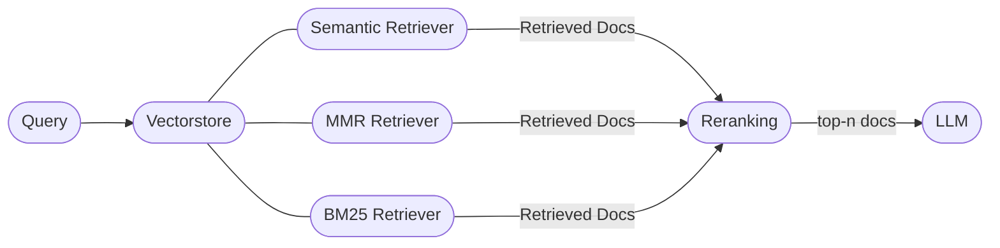

# OR-Assistant

## Introduction

The OpenROAD chat assistant aims to provide easy and quick access to information regarding tools, responses to questions and commonly occurring problems in OpenROAD and its native flow-OpenROAD-flow-scripts.

The current architecture uses certain retrieval techniques on OpenROAD documentation and other online data sources. We aim to continuously improve the architecture and the associated the dataset to improve accuracy, coverage and robustness.

## Use Cases

- **Installation and Troubleshooting Assistance:** The chatbot will provide users with quick and accurate solutions to common installation issues and troubleshooting steps.
- **Easy Access to Existing Resources:** The chatbot will be able to summarizing relevant information from OpenROAD documentation, user guides, and online resources to provide concise and actionable answers to user queries.

## Setup

### Building Manpages

Build manpages as per the instructions [here](https://github.com/The-OpenROAD-Project/OpenROAD/tree/master/docs). Place the markdown files in `backend/data/markdown/manpages` before proceeding.

### Option 1 - Docker

Ensure you have `docker` and `docker-compose` installed in your system.

- **Step 1**: Clone the repository:

```bash
  git clone https://github.com/The-OpenROAD-Project/ORAssistant.git
```

- **Step 2**: Copy the `.env.example` file, and update your `.env` file with the appropriate API keys. Get the [Google Gemini API Key](https://ai.google.dev) and add it to your env file, add other env vars as required.

```bash
  cd backend
  cp .env.example .env
```

- **Step 3**: Start the server by running the following command:

```bash
  docker compose up
```

### Option 2 - Local Install

- Prerequisites: Python 3.12, recommended to use a virtual environment like `conda`.
- **Step 1**: `pip install -r backend/requirements.txt`
- **Step 2**: Copy the `.env.example` file as shown above.
- **Step 3**: To scrape OR/ORFS docs and populate the `data` folder, run:

```bash
  cd backend && python scrape_docs.py
```

- **Step 4**: To run the server:
```bash
  python main.py
```

## Architecture Overview

Currently, documentation from OpenROAD and OpenROAD-flow-scripts is chunked recursively and embedded into FAISS Vector Databases.  

Documents are first retrieved from the vectorstore using a hybrid retriever, combining vector and semantic search methods. These retrieved documents undergo reranking using a cross-encoder reranker model.

Then top-n documents from the reranked set are then sent to the LLM as input context, for generating a response.



The backend will then be hosted at [http://0.0.0.0:8000](http://0.0.0.0:8000). 

Open [http://0.0.0.0:8000/docs](http://0.0.0.0:8000/docs) for the API docs.


## Tests

1) Ruff (TODO)

2) Mypy: A static type checker for python

```
pip install mypy 
mypy .
```

To install it as a pre-commit hook:
```
pip install pre-commit
pre-commit install
```

