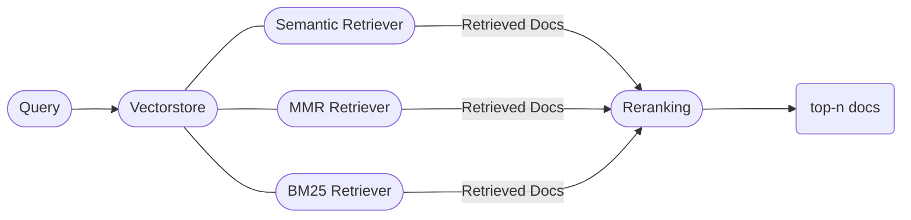

# OR-Assistant

## Introduction

The OpenROAD chat assistant aims to provide easy and quick access to information regarding tools, responses to questions and commonly occurring problems in OpenROAD and its native flow OpenROAD-flow-scripts.

The current architecture uses certain retrieval techniques on OpenROAD documentation and other online data sources. We aim to continuously improve the architecture and the associated the dataset to improve accuracy, coverage and robustness.

## Use Cases

- **Installation and Troubleshooting Assistance:** The chatbot will provide users with quick and accurate solutions to common installation issues and troubleshooting steps.
- **Easy Access to Existing Resources:** The chatbot will be able to summarize relevant information from OpenROAD documentation, user guides, and online resources to provide concise and actionable answers to user queries.

## Components

We have divided our app into three components, each of which can be hosted on a separate machine for scalability. 
- Backend: Generates the necessary chat endpoints for users to communicate.
- Frontend: We use Streamlit to communicate with a chat endpoint, providing a user-friendly chat interface.
- Evaluation: Besides the vanilla chat interface, we also have a human evaluation interface for research and development.

## Setup

This setup involves the setting of both the frontend and backend components. We shall begin with backend: 

### Backend Setup

#### Option 1 - Docker

Ensure you have `docker` and `docker-compose` installed in your system.

- **Step 1**: Clone the repository:

```bash
  git clone https://github.com/The-OpenROAD-Project/ORAssistant.git
```

- **Step 2**: Copy the `.env.example` file, and update your `.env` file with the appropriate API keys. Get the [Google Gemini API Key](https://ai.google.dev) and add it to your env file, add other env vars as required.

```bash
  cd backend
  cp .env.example .env
```

- **Step 3**: Start the server by running the following command:

```bash
  docker compose up
```

#### Option 2 - Local Install

- Prerequisites: Python 3.12, recommended using a virtual environment like `conda`.
- **Step 1**: `pip install -r backend/requirements.txt`
- **Step 2**: Copy the `.env.example` file as shown above.
- **Step 3**: For populating the `data` folder with OR/ORFS docs, OpenSTA docs and Yosys docs, run:

```bash
  cd backend && python build_docs.py
```

- **Step 4**: To run the server:
```bash
  python main.py
```

-**Optionally**: To interact with the chatbot in your terminal, run:
```bash
python chatbot.py
```

The backend will then be hosted at [http://0.0.0.0:8000](http://0.0.0.0:8000). 

Open [http://0.0.0.0:8000/docs](http://0.0.0.0:8000/docs) for the API docs.

### Frontend Setup

**Note**: Please refer to the frontend [README](./frontend/README.md) for more detailed instructions.

- **Step 1**: Set up the `.env` as per the instructions in the frontend [README](./frontend/README.md). Get the [Google Sheet API Key](https://developers.google.com/sheets/api/guides/concepts)
```bash
cd frontend
cp .env.example .env
```

- **Step 2**: Install the necessary requirements. You are encouraged to use a virtual environment for this.
```bash
pip install -r requirements.txt
```

- **Step 3**: Run streamlit application
```bash
streamlit run streamlit_app.py
```

## Architecture Overview

OpenROAD documentation, OpenROAD-flow-scripts documentation, manpages and OpenSTA documentation is chunked and embedded into FAISS Vector Databases.  

Documents are first retrieved from the vectorstore using a hybrid retriever, combining vector and semantic search methods. These retrieved documents undergo re-ranking using a cross-encoder re-ranker model.


Depending on the input query, each query can be forwarded to any one of the following retrievers,
1. General OR/ORFS information
2. OR tools and commands
3. OR/ORFS installation
4. OR Error Messages
5. OpenSTA docs
5. Yosys docs

The retrievers act as separate tools and can be accessed by the LLM's tool-calling capabilities.

The `langgraph` framework has been used to make effective use of the multiple retriever tools. Upon receiving a query, a routing LLM call classifies the query and forwards it to the corresponding retriever tool. Relevant documents are the queried from the vectorstore by the tool and sent to the LLM for response generation.


## Tests

1) Ruff: Auto-formatter and checker for python

```
pip install ruff
ruff format && ruff check
```

2) Mypy: A static type checker for python

```
pip install mypy 
mypy .
```

To install it as a pre-commit hook:
```
pip install pre-commit
pre-commit install
```

